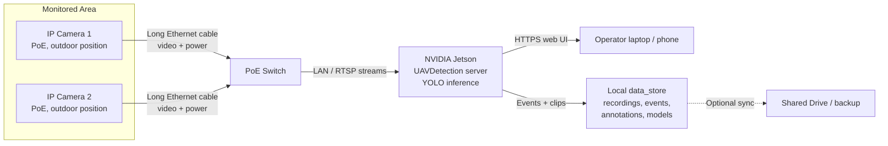
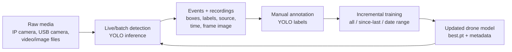
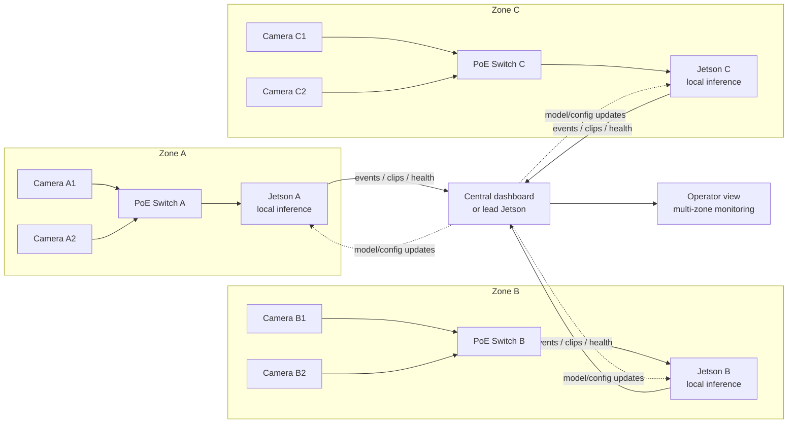

# UAV Detection Project Brief - 6 Slide Deck Prompt

Use this brief to generate a concise 5-6 slide presentation. The style should be
technical but business-readable: dark UI screenshots, clean architecture diagrams,
short bullets, and no heavy paragraphs.

## Slide 1 - Mission And Value

**Title:** Edge UAV Detection From Local Cameras

**Core message:** Build an open-source, field-deployable system that detects
drones from live video streams, records evidence, and improves over time through
annotation and incremental training.

**Bullets:**

- Detect UAV/drone activity from live cameras, video files, and image media.
- Run inference locally at the edge to avoid cloud dependency and reduce latency.
- Record detection events with bounding boxes, labels, timestamps, source camera,
  and media evidence.
- Support manual annotation and incremental model improvement from field data.
- Keep deployment practical: Jetson edge device, PoE cameras, local web UI,
  offline-capable installation.

**Visual suggestion:** Hero image or UI screenshot of live detection with boxes,
with three compact callouts: Detect, Record, Improve.

## Slide 2 - Current PoC Capabilities

**Title:** What Works Today

**Core message:** The current PoC already covers the full operational loop:
capture, detect, annotate, train, record, and deploy.

**Bullets:**

- Live Detection tab supports USB/local cameras, RTSP/IP cameras, and local media.
- Multiple sources can run in parallel with preview tiles and event logging.
- Annotation tab saves YOLO train/val labels from images and video frames.
- Training tab supports all-data, since-last-training, and date-range snapshots.
- Data store separates code from large artifacts: raw data, datasets, models,
  detection results, events, recordings, and system configuration.
- Offline and Windows patch deployment flows exist for field laptops.

**Visual suggestion:** Use three horizontal blocks:
`Live Detection UI` -> `Annotation + Training` -> `Data Store + Deployment`.

## Slide 3 - Field Architecture: 2 PoE IP Cameras + Jetson

**Title:** Initial Field Deployment Architecture

**Core message:** Two remote IP cameras connect over long Ethernet cables to a
PoE switch; a Jetson device performs local detection and serves the operator UI.

**Diagram-ready Mermaid:**

**Bullets:**

- Cameras only need network and power from the PoE switch.
- Jetson reads RTSP streams, runs YOLO detection, records evidence, and hosts UI.
- Operator connects to the Jetson web server over HTTPS from laptop or phone.
- System can continue locally even without Internet.
- Google Drive or other remote storage is optional for backup/handoff.

**Visual style:** Use physical edge-computing topology. Make camera cables visible
and label them "long PoE cable".

## Slide 4 - Software And Data Workflow

**Title:** Closed Loop: Detect, Review, Train, Redeploy

**Core message:** The project is not only a detector; it is a feedback loop for
improving detection quality from real field recordings.

**Diagram-ready Mermaid:**

**Bullets:**

- Detection creates event logs and labeled evidence clips/images.
- Weak or false detections become new annotation candidates.
- Incremental training can focus only on newly annotated field media.
- Updated model is stored in the data store and reused by live detection.
- Detection reports remain triage tools until a larger ground-truth validation
  set exists.

**Visual suggestion:** Circular improvement loop with the model feeding back into
live detection.

## Slide 5 - Scalability Option: Cascaded Jetson Edge Nodes

**Title:** Scaling To More Cameras And Sites

**Core message:** Scale by adding camera groups and Jetson edge nodes. Each node
handles local cameras and forwards only compact events, clips, and health status.

**Diagram-ready Mermaid:**

**Bullets:**

- One Jetson per camera cluster keeps raw video processing close to the cameras.
- Upstream links carry events and selected clips instead of all raw video.
- A lead Jetson or central server can aggregate alerts and distribute model
  updates/configuration.
- Failure is contained: if one node goes down, other zones continue operating.
- Capacity planning can be tuned per node: cameras per Jetson, FPS, image size,
  model size, and detection confidence.

**Visual style:** Show repeated edge-node blocks, not one huge central server.

## Slide 6 - Roadmap And Decisions

**Title:** Next Steps Toward Field-Ready Product

**Core message:** The next phase is hardening: better cameras, alert policy,
field validation, and deployment packaging.

**Bullets:**

- Validate outdoor IP cameras: resolution, lens/FOV, low-light behavior, and
  RTSP stability.
- Define alert policy: audible alarm, browser notification, SMS/Telegram/email,
  event severity, debounce, and operator acknowledgement.
- Improve model quality through targeted annotation of false positives and false
  negatives from field recordings.
- Benchmark Jetson performance: per-camera FPS, maximum streams per model, CPU/GPU
  load, temperature, and memory.
- Prepare production deployment: automatic startup, secure credentials, remote
  update workflow, backups, and monitoring.
- Keep code open source under AGPL-3.0; keep private datasets separate unless a
  sanitized public dataset is intentionally published.

**Visual suggestion:** Roadmap lane with four milestones:
`Field camera validation` -> `Alerting` -> `Model improvement` -> `Scalable deployment`.

## Optional One-Sentence Closing

The system is designed as a practical edge-AI loop: cameras detect locally,
operators review evidence, new field data improves the model, and additional
Jetson nodes scale coverage without centralizing all raw video.
